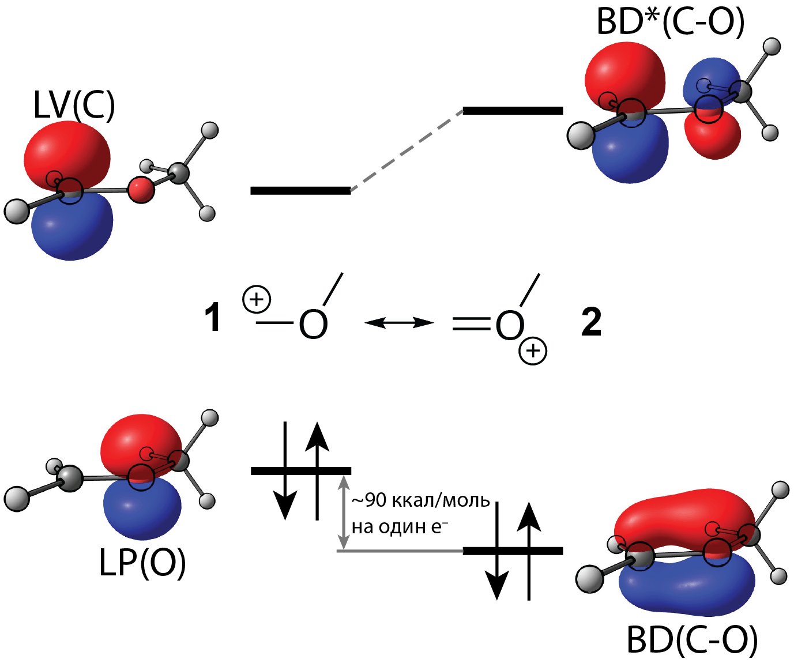
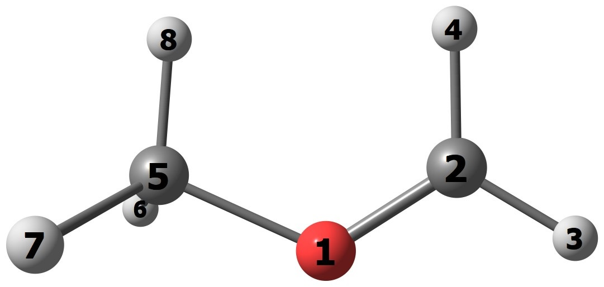
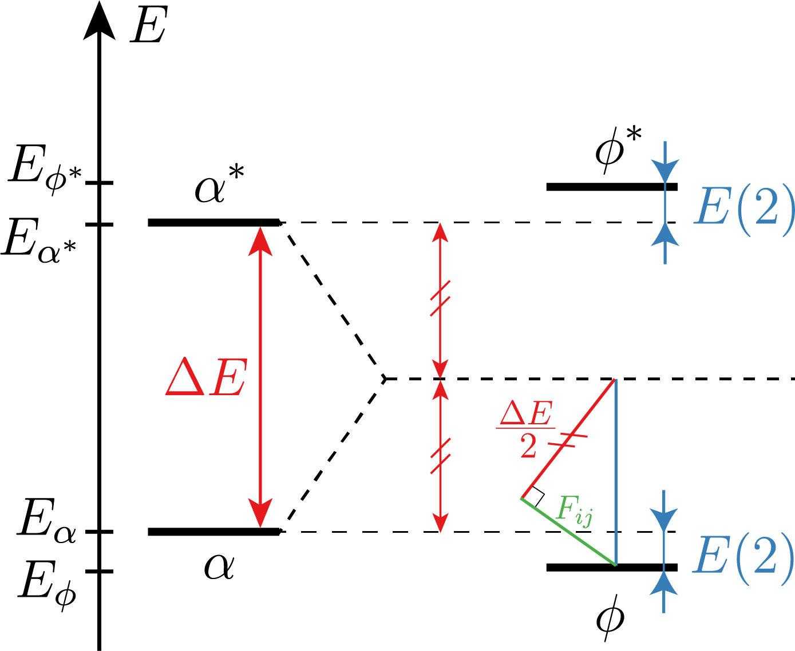
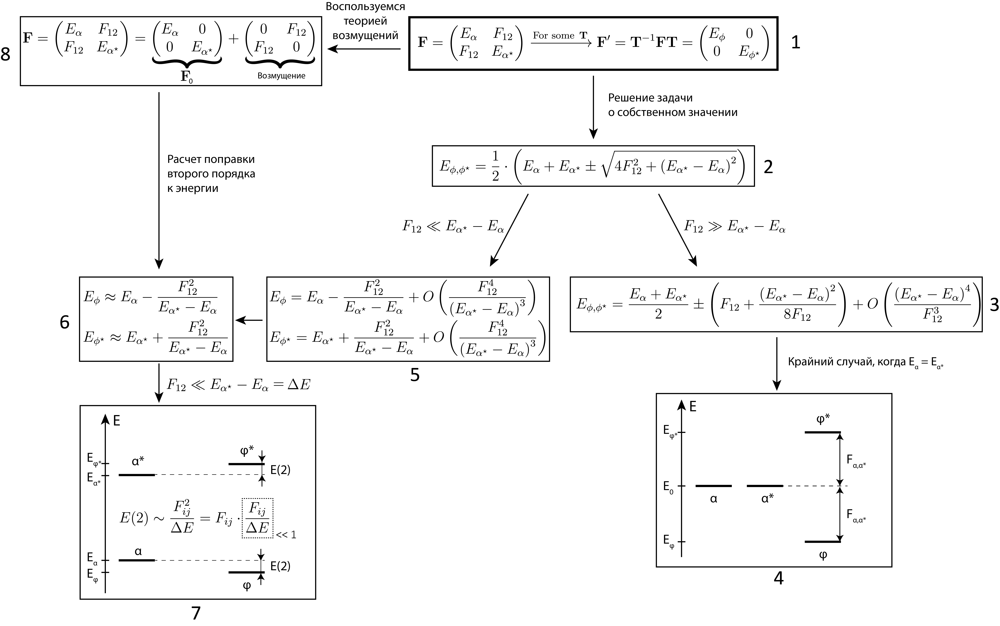
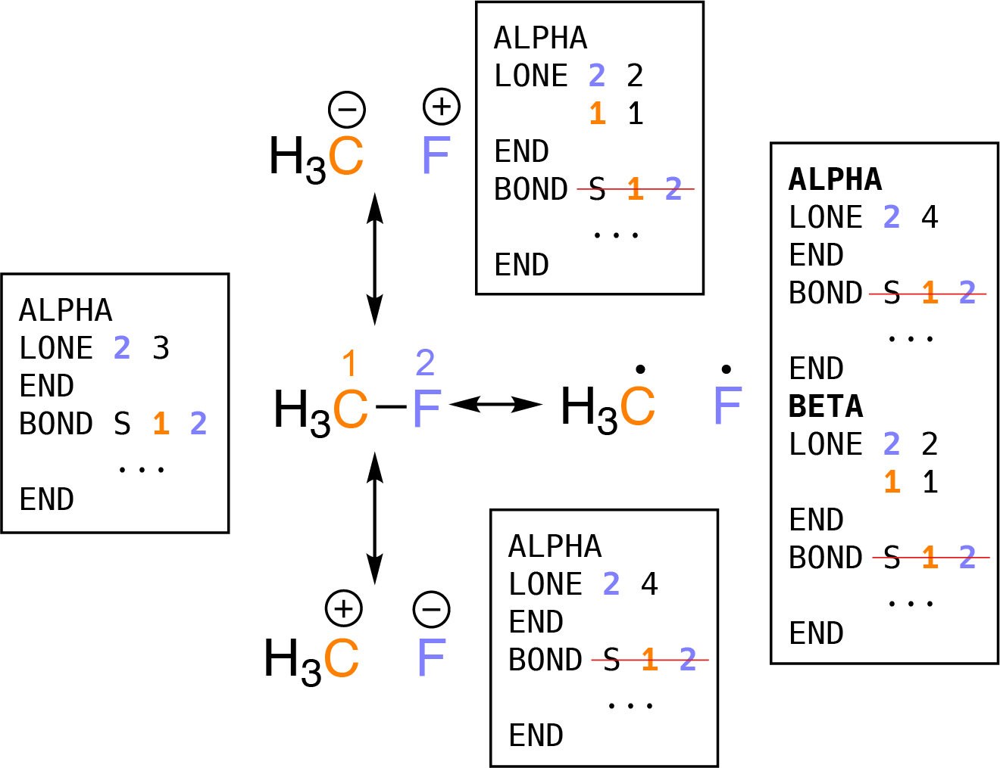
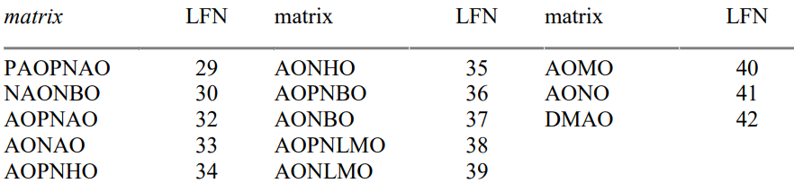

## Анализ NBO и проблема с оценкой сильных взаимодействий

Анализ NBO (natural bonding orbitals, натуральные связевые орбитали) - это полезный инструмент для детального изучения электронных эффектов в молекулах, ионах и ПС. С его помощью можно получать вклады в энергию конкретных путей делокализации электронов в системе и доказывать весомость их вклада в стабилизацию/дестабилизацию анализируемой структуры.

Количество NBO конкретной молекулы равно числу её молекулярных орбиталей (MO), но есть два важных отличия NBO от MO:
1. NBO локализованы на конкретных связях или атомах. Например, если в молекуле есть связь С=С, то в наборе NBO будут орбитали σ(С-С), π(С-С), σ*(С-С), π*(С-С), а, если в молекуле есть обычный sp2-гибридный атом кислорода, то будут NBO двух неподеленных пар и σ+σ* орбитали двух связей. Вследствие этого, есть несколько типов NBO, все они приведены ниже в тех обозначениях, в которых они выписываются в log-файле:
	* Связывающие и разрыхляющие орбитали связи - BD и BD*, соответственно;
	* Орбиталь неподеленной пары на атоме - LP;
	* Орбиталь внутренных (невалентных) электронов - CR;
	* Незанятая (вакантная) орбиталь на атоме - LV или LP* (обозначение зависит от версии программы);
	* Высокие по энергии незанятые орбитали - RY;
	* Связывающие и разрыхляющие орбитали трехцентровых связей - 3C, 3C* (их поиск необходимо включить отдельно ключом 3CBOND).
2. NBO, в отличие от МО, могут иметь ненулевое перекрывание друг с другом, это значит, что электроны с занятых NBO могут делокализоваться на свободные NBO (последние из-за этого становятся частично занятыми). Значения энергии стабилизации системы от этих взаимодействий вычисляются автоматически и выдаются в секции "SECOND ORDER PERTURBATION THEORY ANALYSIS OF FOCK MATRIX IN NBO BASIS" в третьем столбце.

Далее, важно понять, что NBO-анализ проводится для определенной резонансной структуры, то есть для конкретно выбранных кратностей связей и количеств неподеленных пар на всех атомах. А из резонансной структуры программа сама определяет типы и локализацию всех NBO. 

Обычно NBO-анализ выполняют без указания пользователем требуемой резонансной структуры, и программа сама подбирает оптимальную расстановку кратностей связей и неподеленных пар на атомах из принципа, что на незанятых орбиталях должно находиться как можно меньше электронов. Этот принцип понятен: если на свободные NBO делокализовано достаточно много электронов, а на занятых NBO число электронов понижено, то это значит, что было упущено какое-то сильное взаимодействие орбиталей и данный набор NBO не совсем корректно описывает систему.

В случаях, когда нужно оценить энергию достаточно сильной делокализации, автоматический выбор резонансной структуры не всегда приводит к информативным результатам. Ниже будут даны пошаговые инструкции решения этой проблемы на примере взаимодействия LP(O)→LV(C) в метоксиметильном катионе (см. рисунок ниже), а также приведены инструкции по визуализации взаимодействующих NBO, следуя которым можно наглядно представить полученные результаты.



В данном случае резонансная структура **2** автоматически выбирается оптимальной. Однако, набор NBO для **2** содержит две пары орбиталей BD(С-О) + BD\*(С-О) (одна пара для σ-связи, другая - для π-связи). То есть делокализация пары кислорода на свободную р-орбиталь углерода была настолько сильной, что она описана, как отдельная π-связь. В итоге, анализ резонансной структуры **2** неинформативен, потому что нет взимодействия NBO, которое бы соответствовало делокализации пары кислорода, а есть только π и π\* орбитали связи C=O. 

Чтобы обойти эту проблему, нужно через ключевое слово $CHOOSE запустить расчет резонансной структуры **1**. Это можно делать двумя способами: пользуясь только средствами Gaussian и встроенной в него NBO3.1 ([мануал](http://www.ccl.net/cca/software/MS-WIN95-NT/mopac6/nbo.htm)), либо делать расчет NBO отдельно от расчета Gaussian в NBO6 ([мануал](https://nbo.chem.wisc.edu/nboman.pdf)). Первый способ проще, так как в нем не нужно генерировать файл *.47 с входными данными для анализа и разбираться с запуском более свежей версии NBO.

## Инструкции по расчету средствами Gaussian/NBO3.1

Перед началом анализа NBO убедитесь, что геометрия вашей молекулы была оптимизирована на том же уровне теории, на котором будут делаться описанные ниже расчеты. Идеально, если геометрия соответствует минимуму ППЭ, но разумные результаты получаются и для ПС, и для структур, оптимизированных с констрейнами. 

1. Сделать расчет single-point в Gaussian и NBO-анализ для автоматически выбранной резонансной структуры. Входной gjf-файл должен отличаться от обычного расчета ключевыми словами в начале (```pop=nboread```) и в конце (```$NBO $END```):

```
%nprocshared=16
#p 6-311++g(d,p) empiricaldispersion=gd3bj rpbe1pbe pop=nboread

nbotest

1 1
 O                  0.14792300   -0.46679600   -0.00000200
 C                  1.18587000    0.19751600    0.00000100
 H                  2.12091400   -0.36493800    0.00000500
 H                  1.16324400    1.29221800   -0.00000400
 C                 -1.18972400    0.14455200    0.00000100
 H                 -1.67482200   -0.23782300   -0.89659100
 H                 -1.67482700   -0.23784800    0.89657900
 H                 -1.09476600    1.23034500    0.00001300

$NBO $END


```

2. Узнать оптимальную резонансную структуру для нашей молекулы и поменять её. Так как NBO3.1 нигде не выписывает секцию $CHOOSE для выбраной резонансной структуры, её нужно сгенерировать python-скриптом [get_choose.py](./get_choose.py). Этот скрипт принимает путь к log-файлу из предыдущего расчёта в качестве единственного аргумента. Например, если на шаге 1 были получены файлы ```calc1.gjf``` и ```calc1.log```, то команда и результат должны выглядеть так:

```
> get_choose.py calc1.log
$CHOOSE
ALPHA
LONE 1 1
END
BOND D 1 2
     S 1 5
     S 2 3
     S 2 4
     S 5 6
     S 5 7
     S 5 8
END
$END
```

Получившаяся секция $CHOOSE ... $END содержит информацию о резонансной структуре, выбранной программой автоматически:

```
$CHOOSE
ALPHA
LONE 1 1  // Формат: номер атома - число неподеленных пар на нём
END
BOND D 1 2  // Формат: кратность связи(S - single, D - double, etc.) - номер первого атома - номер второго атома
     S 1 5
     S 2 3
     S 2 4
     S 5 6
     S 5 7
     S 5 8
END
$END
```



Для удобства дана нумерация атомов в структуре. Приведенная выше секция $CHOOSE соответствует резонансной структуре **2** с двойной C=O связью, её нужно изменить:

```
$CHOOSE
ALPHA
LONE 1 2
END
BOND S 1 2
     S 1 5
     S 2 3
     S 2 4
     S 5 6
     S 5 7
     S 5 8
END
$END
```

Связь между атомами *1* и *2* сделали одинарной, вместо двойной, и поставили две неподеленные пары на кислород, вместо одной. Такая секция $CHOOSE соответствует резонансной структуре **1**.

3. Последний шаг - запуск анализа NBO с указанием требуемой резонансной структуры. Для этого нужно создать файл ```calc2.gjf``` с секцией $CHOOSE … $END в конце. В итоге он должен выглядеть так:

```
#p 6-311++g(d,p) empiricaldispersion=gd3bj rpbe1pbe pop=nboread

nbotest

1 1
 O                  0.14792300   -0.46679600   -0.00000200
 C                  1.18587000    0.19751600    0.00000100
 H                  2.12091400   -0.36493800    0.00000500
 H                  1.16324400    1.29221800   -0.00000400
 C                 -1.18972400    0.14455200    0.00000100
 H                 -1.67482200   -0.23782300   -0.89659100
 H                 -1.67482700   -0.23784800    0.89657900
 H                 -1.09476600    1.23034500    0.00001300

$NBO $END
$CHOOSE
ALPHA
LONE 1 2
END
BOND S 1 2
     S 1 5
     S 2 3
     S 2 4
     S 5 6
     S 5 7
     S 5 8
END
$END
```

Чтобы найти энергию стабилизации карбокатиона за счет делокализации пары кислорода, надо найти в ```calc2.log``` секцию "SECOND ORDER PERTURBATION THEORY ANALYSIS OF FOCK MATRIX IN NBO BASIS", а в ней - взаимодействие с донором LP(O) и акцептором LP*(C). Энергия этого взаимодействия, ~181 ккал/моль - это оценка стабилизации карбокатиона неподеленной парой кислорода.

## Инструкции по расчету средствами Gaussian и NBO6

Перед началом анализа NBO убедитесь, что геометрия вашей молекулы была оптимизирована на том же уровне теории, на котором будут делаться описанные ниже расчеты. Идеально, если геометрия соответствует минимуму ППЭ, но разумные результаты получаются и для ПС, и для структур, оптимизированных с констрейнами.

1. Выполнить расчет single-point в Gaussian, чтобы сгенерировать input-файл для NBO.
Входной gjf-файл должен отличаться от обычного расчета ключевыми словами в начале (```pop=nboread```) и в конце (```$NBO file=nbotest archive $END```):

```
%nprocshared=16
#p 6-311++g(d,p) empiricaldispersion=gd3bj rpbe1pbe pop=nboread

nbotest

1 1
 O                  0.14792300   -0.46679600   -0.00000200
 C                  1.18587000    0.19751600    0.00000100
 H                  2.12091400   -0.36493800    0.00000500
 H                  1.16324400    1.29221800   -0.00000400
 C                 -1.18972400    0.14455200    0.00000100
 H                 -1.67482200   -0.23782300   -0.89659100
 H                 -1.67482700   -0.23784800    0.89657900
 H                 -1.09476600    1.23034500    0.00001300

$NBO file=nbotest archive $END


```

После завершения расчета в директории, из которой запускался Gaussian, должен появиться файл ```NBOTEST.47```. Это input-файл для анализа NBO.

2. Следующий шаг - узнать оптимальную резонансную структуру для нашей молекулы и поменять её. Для этого нужно скопировать ```NBOTEST.47``` на Vertex, на нём установлена программа NBO6, и запустить анализ NBO:

```
ssh xray@10.8.0.28 "mkdir my_folder"
scp NBOTEST.47 xray@10.8.0.28:~/my_folder
ssh xray@10.8.0.28
	cd my_folder
	NBO6 NBOTEST.47
	logout
scp xray@10.8.0.28:~/my_folder/NBOTEST_NBO.out .
```

В файле ```NBOTEST_NBO.out``` нужно найти секцию с информацией о резонансной структуре:

```
 $CHOOSE
     LONE 1 1 END // Формат: номер атома - число неподеленных пар на нём
     BOND D 1 2 S 1 5 S 2 3 S 2 4 S 5 6 S 5 7 S 5 8 END // Формат: кратность связи(S - single, D - double, etc.) - номер первого атома - номер второго атома
 $END
```

Приведенная выше секция $CHOOSE соответствует резонансной структуре **2** с двойной C=O связью, и идентична генерируемой скриптом выше, за исключением переносов строк, что влияет только на читаемость. Аналогично предыдущему разделу, её нужно модифицировать:

```
 $CHOOSE
     LONE 1 2 END
     BOND S 1 2 S 1 5 S 2 3 S 2 4 S 5 6 S 5 7 S 5 8 END
 $END
```

Связь между атомами *1* и *2* сделали одинарной, вместо двойной, и поставили две неподеленные пары на кислород, вместо одной. Такая секция $CHOOSE соответствует резонансной структуре **1**.

3. Последний шаг - запуск анализа NBO с указанием требуемой резонансной структуры. Для этого нужно добавить в файл ```NBOTEST.47``` модифицированную секцию $CHOOSE ... $END сразу после секции $NBO ... $END. В итоге, начало файла ```NBOTEST.47``` должно выглядеть так:

```
 $GENNBO  NATOMS=8  NBAS=101  UPPER  BODM  $END
 $NBO  $END
 $CHOOSE
     LONE 1 2 END
     BOND S 1 2 S 1 5 S 2 3 S 2 4 S 5 6 S 5 7 S 5 8 END
 $END
 $COORD
 nbotest                                                                       
      8     8      -0.147923      -0.466796       0.000002
      6     6      -1.185870       0.197516      -0.000001
	  ...
```

Запуск расчета нужно провести по алгоритму из п.2.

Чтобы найти энергию стабилизации карбокатиона за счет делокализации пары кислорода, надо найти в ```NBOTEST.out``` секцию "SECOND ORDER PERTURBATION THEORY ANALYSIS OF FOCK MATRIX IN NBO BASIS", а в ней - взаимодействие с донором LP(O) и акцептором LV(C). Энергия этого взаимодействия, так же, как и в случае со встроенным в Gaussian NBO3.1, составляет ~181 ккал/моль.

## Особенности оценки сильных взаимодействий

Стоит отметить, что два описанных выше подхода позволяют только оценить энергию делокализации в приближении теории возмущений второго порядка. Это значит, что нужно быть аккуратными при работе с абсолютными энергиями взаимодействий, потому что они достаточно велики, а чем выше энергия, тем больше ошибается теория возмущений. Однако, если рассматривать разности энергий взаимодействий в похожих молекулах, то ошибки компенсируют друг друга, и полученные значения указывают, в какой из структур эффект сильнее, и на сколько ккал/моль.

Рассмотрим подробнее матчасть расчета энергии взаимодействия орбиталей, для этого введем обозначения орбиталей до и после взаимодействия (см. энергетическую диаграмму ниже):

$$ \alpha,\ \alpha^\star\ -$$занятая и незанятая NBO, которые могут взаимодействовать друг с другом.

$$ \phi,\ \phi^\star\ -$$NBO, изменившиеся после взаимодействия друг с другом (энергия занятой орбитали немного понижается, а свободной - немного повышается).

### Теория возмущений второго порядка

Формула, которой NBO пользуется для расчета энергии делокализации электронов с одной орбитали на другую, выглядит так:

$$ 
E_{inter} = (n_\alpha + n_{\alpha^\star}) \cdot (E_\alpha - E_\phi) = (n_\alpha + n_{\alpha^\star}) \frac{F_{ij}^2}{\Delta E},
$$

где$$\Delta E = E_{\alpha^\star} - E_\alpha$$- это разница энергий NBO-донора и NBO-акцептора,$$F_{ij} = \langle \alpha^\star | F | \alpha \rangle$$- это недиагональный элемент матрицы Фока или Кона-Шэма (энергия, с которой взаимодействовали бы NBO, если бы их энергии были одинаковыми),$$n_\alpha,\ n_{\alpha^\star}$$- занятости донорной и акцепторной орбиталей.

Это приближение хорошо тем, что оно универсально и одинаково хорошо работает для систем с любым количеством орбиталей. Единственное ограничение - энергия взаимодействия должна быть небольшой: 

$$ F_{ij} \ll \Delta E $$

### Приближение двух орбиталей

Для получения более аккуратных оценок энергий сильных взаимодействий можно воспользоваться другим приближением, которое правильно описывает взаимодействие пары орбиталей друг с другом, но пренебрегает присутствием других орбиталей в системе.

$$ 
E_{\phi} = \frac{1}{2} \cdot \left( E_{\alpha} + E_{\alpha^{\star}} - \sqrt{4F_{12}^2 + \left( E_{\alpha^{\star}} - E_{\alpha}\right)^2 } \right)
$$

Эта формула имеет геометрический смысл, проиллюстрированный на картинке ниже:



Посчитаем по этой формуле энергию делокализации неподеленной пары кислорода в оксикарбениевом ионе. Энергии и занятости орбитали-донора и акцептора ищите в секции "Natural Bond Orbitals (Summary)".

$$ F_{ij} =  0.181\ a.u.;\ E_\alpha = -0.62797\ a.u.; \ E_{\alpha^\star} = -0.40156\ a.u.;$$\
$$\Delta E = E_{\alpha^\star} - E_\alpha = 0.22641\ a.u.;\ n_\alpha = 1.512;\ n_{\alpha^\star} = 0.509$$\
$$ \Rightarrow E_\phi = -0.728\ a.u.; E_{inter} = (n_\alpha + n_{\alpha^\star}) \cdot (E_\alpha - E_\phi) = 127.2\ kcal/mol$$

В приближении второго порядка теории возмущений энергия взаимодействия получается 180 ккал/моль. А значит, приближение, которым стандартно пользуется NBO, делает ошибку  почти в 30% в случае делокализации пары кислорода в оксикарбениевом ионе.

Читателям, заинтересовавшимся выводом формул описанных приближений, предлагаю ознакомиться со схемой ниже и [мануалом по расчетам взаимодействий орбиталей](./orbital_interactions.pdf).



## Про виды разрыва связи

Работая над практическими задачами, имейте в виду, что существует несколько вариантов секций $CHOOSE, соответствующих разрыву какой-то одной связи:



Всего можно предложить три варианта: два пути гетеролитического разрыва и один гомолитический путь. Выбирайте тот вариант, который считаете наиболее "физичным" для вашей молекулы.

## Инструкции по визуализации взаимодействующих NBO

Чтобы нарисовать взаимодействующие NBO в ChemCraft необходимо либо создать набор файлов \*.31-\*.41, либо файл \*.fchk. Ниже описано оба способа, я рекомендую пользоваться первым, так как он выписывает NBO с правильной нумерацией и работает для NBO6. 

### Способ через файлы \*.31-\*.41 и NBO3.1:

1. Выполнить расчет в Gaussian с последующим расчетом NBO. При этом в секции $NBO нужно добавть ключевое слово ```PLOT```. Также нужна секция $CHOOSE, если нужно задать резонансную структуру. Пример gjf-файла:
```
#p 6-311++g(d,p) empiricaldispersion=gd3bj rpbe1pbe pop=nboread

nbotest

1 1
 O                  0.14792300   -0.46679600   -0.00000200
 C                  1.18587000    0.19751600    0.00000100
 H                  2.12091400   -0.36493800    0.00000500
 H                  1.16324400    1.29221800   -0.00000400
 C                 -1.18972400    0.14455200    0.00000100
 H                 -1.67482200   -0.23782300   -0.89659100
 H                 -1.67482700   -0.23784800    0.89657900
 H                 -1.09476600    1.23034500    0.00001300

$NBO PLOT FILE=jobname $END
$CHOOSE
ALPHA
 LONE 1 2 END
 BOND S 1 2 S 1 5 S 2 3 S 2 4 S 5 6 S 5 7 S 5 8 END
$END
```

2. После успешного завершения расчета в директории, из которой он запускался, должны появиться файлы \*.31-\*.41. Разные номера соответствуют различным видам натуральных орбиталей, которые можно визуализировать в ChemCraft. Ниже приведен полный список из 49ой страницы [мануала NBO](https://nbo.chem.wisc.edu/nboman.pdf):



Так как мы хотим рисовать связевые орбитали (AONBO), нам нужны файлы \*.37 и \*.31. Их нужно скачать на свой компьютер.

3. Далее нужно открыть файл \*.31 в Chemcraft, выбрать Tools > Orbitals > Render molecular orbitals > NBOs. В появившемся окне нумерация NBO совпадает с нумерацией в log-файле анализа, здесь нужно отметить интересующие вас орбитали.

### Способ через файлы \*.31-\*.41 и NBO6:

1. Сначала нужно получить входной \*.47 файл для NBO6, следуя шагам 1-2 в алгоритме выше.

2. В файле \*.47 надо добавить ключевое слово ```PLOT``` в секцию $NBO. В итоге, начало файла должно выглядеть так:

```
 $GENNBO  NATOMS=8  NBAS=101  UPPER  BODM  $END
 $NBO PLOT FILE=jobname $END
 $CHOOSE
     LONE 1 2 END
     BOND S 1 2 S 1 5 S 2 3 S 2 4 S 5 6 S 5 7 S 5 8 END
 $END
 $COORD
 nbotest                                                                       
      8     8      -0.147923      -0.466796       0.000002
      6     6      -1.185870       0.197516      -0.000001
	  ...
```

3. Дальше нужно скопировать этот файл на компьютер с установленным NBO6 и запустить расчет командой ```NBO6 jobname.47```. Полученные файлы \*.31 и \*.37 нужно скопировать себе на компьютер и повторить пункт 3 из предыдущего алгоритма.

### Способ через файл \*.fchk

Стоит упомянуть про ещё один способ визуализации NBO. Однако, нумерация орбиталей в ChemCraft при будет отличаться от их нумерации в log-файле.
1. Выполнить расчет в Gaussian с последующим расчетом NBO. При этом в секции $NBO не нужно добавлять специальных ключевых слов для генерации новых файлов, а в командной строке Gaussian должен быть ключ pop=SaveNBOs. Также нужна секция $CHOOSE, если нужно задать резонансную структуру. Пример gjf-файла:
```
%chk=test.chk
#p 6-311++g(d,p) empiricaldispersion=gd3bj rpbe1pbe pop=(nboread,savenbos)

nbotest

1 1
 O                  0.14792300   -0.46679600   -0.00000200
 C                  1.18587000    0.19751600    0.00000100
 H                  2.12091400   -0.36493800    0.00000500
 H                  1.16324400    1.29221800   -0.00000400
 C                 -1.18972400    0.14455200    0.00000100
 H                 -1.67482200   -0.23782300   -0.89659100
 H                 -1.67482700   -0.23784800    0.89657900
 H                 -1.09476600    1.23034500    0.00001300

$NBO $END
$CHOOSE
ALPHA
 LONE 1 2 END
 BOND S 1 2 S 1 5 S 2 3 S 2 4 S 5 6 S 5 7 S 5 8 END
$END
```

2. Из полученного файла \*.chk нужно сгенерировать \*.fchk. Для этого используйте команду ```/opt/g16avx/formchk test.chk```, указав правильную директорию с Gaussian.

3. Сгенерированный файл \*.fchk скопируйте себе на компьютер и откройте его в Chemcraft.


Для ещё более основательного изучения какого-либо взаимодействия в вашей молекуле, рекомендую почитать про ключевое слово $DEL на [сайте](https://nbo6.chem.wisc.edu/tut_del.htm) и в [мануале](https://nbo.chem.wisc.edu/nboman.pdf).

-----------------
Рецензенты:\
Медведев М.Г. - проверил, всё работает.\
Куницын А.Ю. - проверил, все работает.
